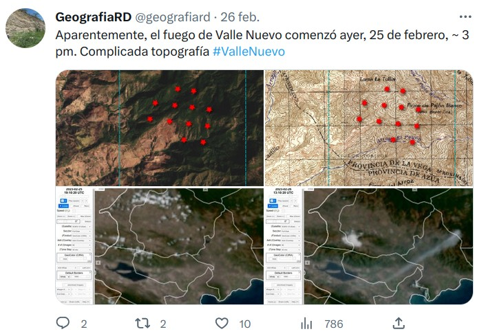
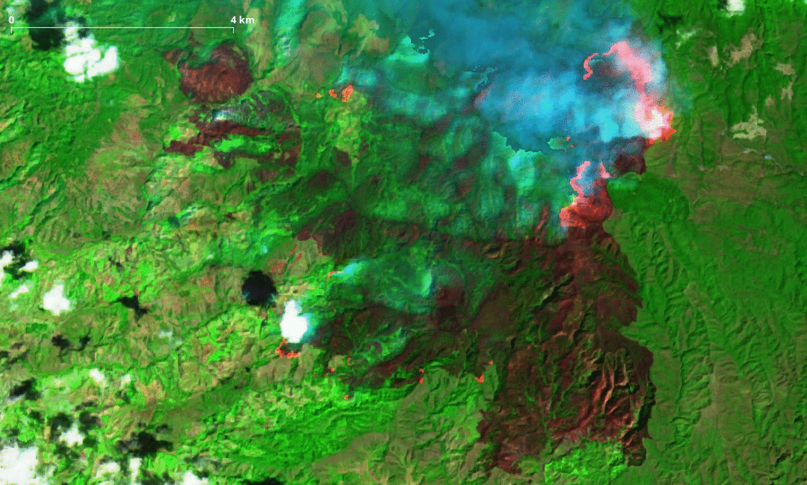

# fuego-valle-nuevo-202302

El 25 de febrero de 2023, dentro del parque nacional Valle Nuevo, hacia su límite centro-occidental, inició un incendio forestal. Realicé un seguimiento desde dicha fecha, con mapas e imágenes de satélite que fue publicando [aquí](https://twitter.com/geografiard).

Usando imágenes satelitales ópticas (Sentinel 2), y aplicando una versión modificada del [*script* Google Earth Engine de UN-Spider “BURN SEVERITY MAPPING USING THE NORMALIZED BURN RATIO (NBR)”](https://un-spider.org/advisory-support/recommended-practices/recommended-practice-burn-severity/burn-severity-earth-engine), realicé un análisis de la severidad de quemado en dicho incendio usando el diferencial del índice normalizado de quema (dNBR) para estimar la superficie quemada. Bajo distintas severidades de quemado, estimé que unos 25.32 km2 (2,532 hectáreas, ~40,000 tareas) se habrían quemado (a distintas severidades) hasta el 4 de marzo, fecha de la imagen más reciente al momento de escribir este resumen. Vale notar que la imagen más reciente presentaba áreas bajo la pluma de humo, la superficie calculada es subestima la real.

